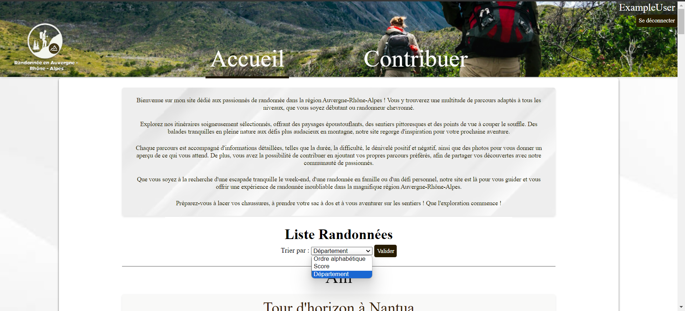
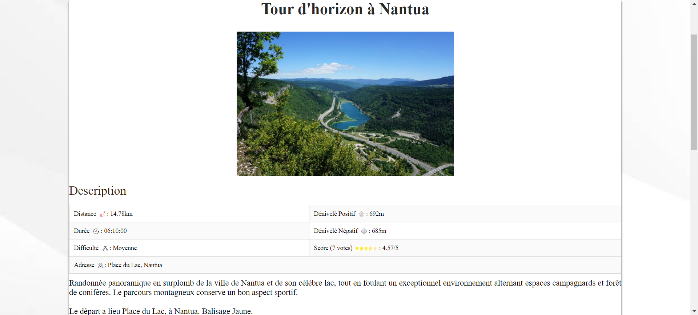
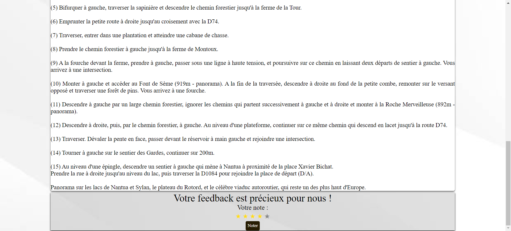
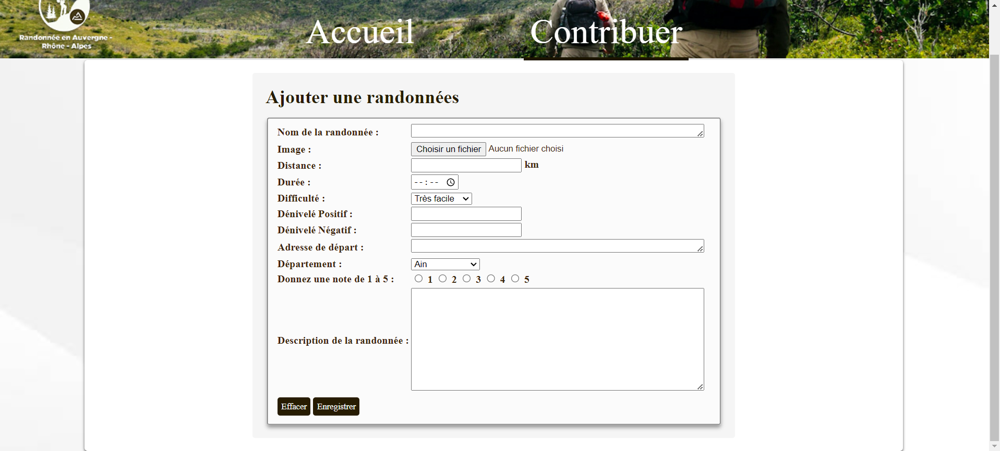
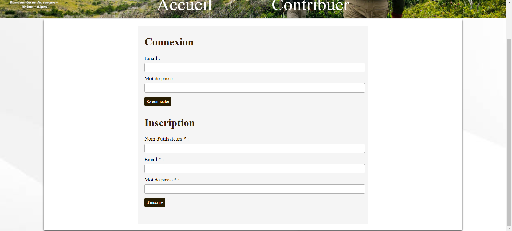

# SiteWebRandonnee

Site web permettant aux utilisateurs d'explorer et d'ajouter des randonnées. Ce projet a été créé dans le cadre d'un travail pratique pour le cours d'introduction aux technologies du web en L3 MIASHS à l'université Grenoble Alpes.

## Exécution

Pour exécuter le programme, suivez ces étapes :

1. Téléchargez et installez [XAMPP](https://www.apachefriends.org/index.html) sur votre machine.

2. Démarrez les modules Apache et MySQL à partir du panneau de contrôle XAMPP.

3. Placez le dossier du projet dans le répertoire `htdocs` de votre installation XAMPP.

4. Accédez au site web dans votre navigateur à l'adresse `http://localhost/votre-dossier-projet`.

## Installation des Bases de Données avec phpMyAdmin

Pour utiliser les bases de données fournies dans le dossier "ExempleBD", suivez les étapes ci-dessous pour les installer à l'aide de phpMyAdmin.

### Étapes d'installation

1. **Connectez-vous à phpMyAdmin :** Ouvrez votre navigateur web et accédez à l'interface de phpMyAdmin.

2. **Créez une nouvelle base de données :** Cliquez sur l'onglet "Bases de données" et créez une nouvelle base de données.

3. **Importez les fichiers SQL :** Sélectionnez la base de données nouvellement créée, puis cliquez sur l'onglet "Importer". Choisissez les fichier SQL qui sont dans le répertoire `ExempleBD`.

## Configuration de l'application

Mettre à jour les informations de connexion à votre BD si besoin dans le fichier `config.php`
